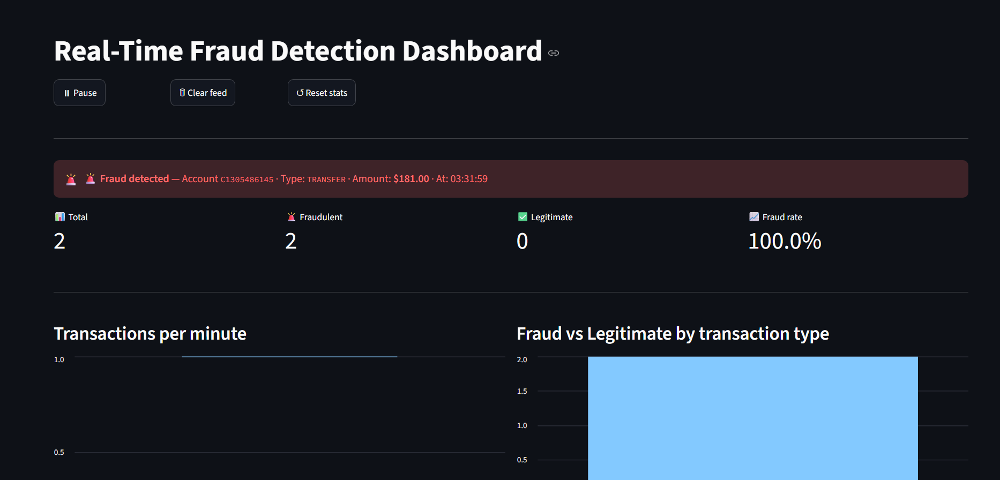
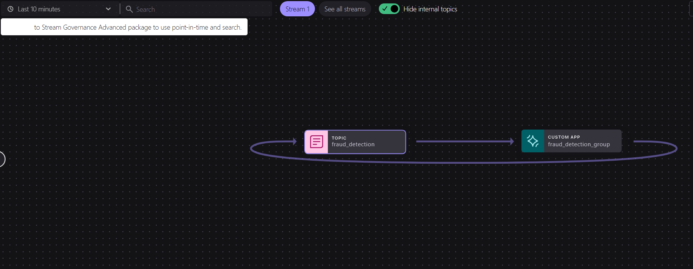
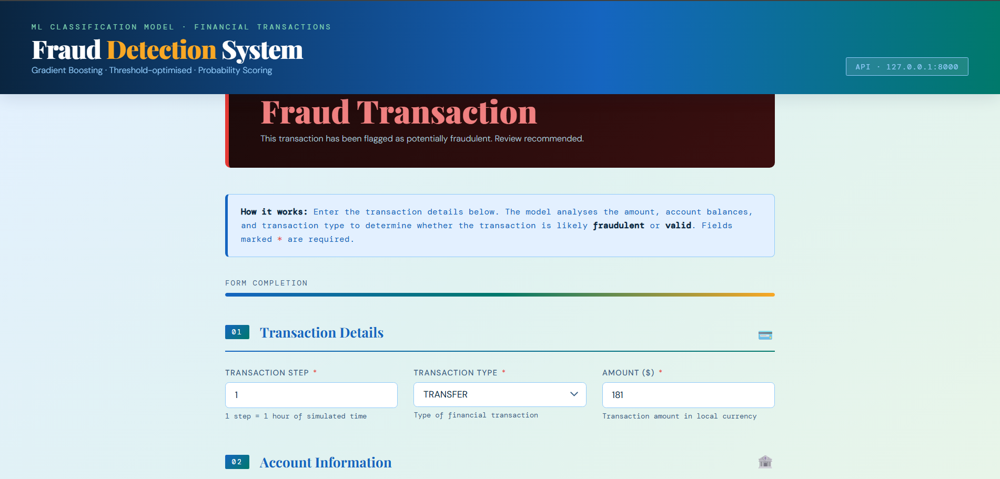

# 🛡️ Real-Time Fraud Detection System

> **End-to-end production-grade fraud detection pipeline** — streaming ML inference over Apache Kafka, threshold-optimized XGBoost classification, FastAPI inference service, and a live Streamlit monitoring dashboard. Containerized with Docker and deployed on Railway.

[](https://www.python.org/)
[](https://fastapi.tiangolo.com/)
[](https://confluent.io/)
[](https://streamlit.io/)
[](https://www.docker.com/)
[](https://railway.app/)
[](https://mlflow.org/)
[](https://xgboost.readthedocs.io/)

---

## 📌 Overview

This project is a **production-style, real-time fraud detection system** that combines classical ML engineering discipline with modern streaming architecture. Transactions are submitted via a FastAPI inference endpoint, passed through a domain-specific feature engineering pipeline, classified by a threshold-optimized gradient boosting model, and streamed through Confluent Kafka into a live Streamlit monitoring dashboard — all running as isolated Docker containers orchestrated via Docker Compose and deployed on Railway.

Every design decision reflects production-grade thinking: key-based Kafka partitioning for account-level ordering guarantees, PR-AUC-optimized model training for imbalanced fraud classification, graceful consumer shutdown with offset commit safety, dead letter queue (DLQ) routing for poison-pill messages, and F-beta threshold tuning that explicitly prioritizes recall over precision — because in fraud detection, a missed fraud costs far more than a false alarm.

---

## 🎬 Demo / Screenshots

| Component | Preview |
|-----------|---------|
| 📊 Streamlit Dashboard |  |
| 🔁 Kafka Architecture Diagram |  |
| 📡 FastAPI Swagger UI |  |

> 📸 *Screenshots are added as the deployment progresses. The system is live on Railway.*
 Fastapi Endpoint: https://frauddetectionapi-production.up.railway.app/
 Dashboard: https://frauddetectiondashboard-production.up.railway.app/ 
---

## ✨ Key Features

- **⚡ Real-Time Streaming Inference** — Transactions are classified in milliseconds and immediately streamed through Kafka, enabling sub-second latency from submission to dashboard visibility
- **🧠 Gradient Boosting Ensemble** — XGBoost, XGBRFClassifier, and LightGBM evaluated under rigorous time-series cross-validation with Optuna hyperparameter search
- **🎯 Threshold Optimization** — Default 0.5 decision boundary replaced by an F-beta tuned threshold that maximizes recall-weighted fraud detection, eliminating the implicit precision bias of standard classifiers
- **🔀 Kafka Streaming Pipeline** — Producer/consumer architecture on Confluent Cloud with key-based partitioning, offset management, retry logic with exponential backoff, and graceful shutdown
- **🪦 Dead Letter Queue (DLQ)** — Malformed, undecodable, or error-raising messages are routed to a dedicated DLQ topic rather than causing consumer crashes or silent data loss
- **📊 Live Monitoring Dashboard** — Streamlit dashboard with 2-second auto-refresh, running a background consumer thread isolated from the UI thread using `threading.RLock` for safe state sharing
- **🏭 Production FastAPI Service** — Lifespan-managed ML pipeline loading, Pydantic input validation, health check endpoint, and Kafka producer integration with BufferError retry
- **🔬 MLflow Experiment Tracking** — All training runs tracked with parameters, PR-AUC metrics, confusion matrices, and serialized model artifacts for reproducibility
- **🐳 Containerized Deployment** — Two isolated Docker images (`Dockerfile.api`, `Dockerfile.dashboard`) with health checks, dependency ordering via `depends_on: service_healthy`, and Railway-compatible `$PORT` injection
- **🔒 Thread-Safe Shared State** — `threading.RLock` + module-level `shared_state` dict bridges the Kafka consumer thread and Streamlit's re-render loop without race conditions
- **⚖️ Imbalanced Classification Handling** — `scale_pos_weight` calibration, SMOTE awareness, and PR-AUC as the primary optimization metric — all accounting for the extreme class imbalance inherent in fraud datasets
- **🔁 Consumer Pause/Resume Control** — `threading.Event`-based `pause_event` and `stop_event` give the dashboard UI live control over the consumer thread lifecycle

---

## 🧰 Tech Stack

### Machine Learning
| Library | Role |
|---------|------|
| XGBoost | Primary gradient boosting classifier with GPU support |
| LightGBM | Comparative gradient boosting baseline |
| XGBRFClassifier | Random forest variant of XGBoost for ensemble diversity |
| Optuna | Bayesian hyperparameter optimization (TPE + Median Pruner) |
| Scikit-learn | Preprocessing, TimeSeriesSplit, PR-AUC, F-beta scoring |
| Pandas / NumPy | Feature engineering and data manipulation |

### Backend
| Library | Role |
|---------|------|
| FastAPI | Async REST API with lifespan management |
| Pydantic v2 | Input validation with `field_validator` |
| Uvicorn | ASGI server |
| Python 3.11 | Runtime |

### Streaming
| Library | Role |
|---------|------|
| Confluent Kafka (Python) | Producer / Consumer client |
| Confluent Cloud | Managed Kafka broker |
| Dead Letter Queue | Error isolation and message recovery |

### Monitoring & Dashboard
| Library | Role |
|---------|------|
| Streamlit | Real-time monitoring dashboard |
| streamlit-autorefresh | 2-second UI refresh cycle |
| Python threading | Background consumer thread management |

### Deployment
| Tool | Role |
|------|------|
| Docker | Container runtime |
| Docker Compose | Multi-service orchestration |
| Docker Hub | Image registry (`asoktamang/fraud_detection_api`, `asoktamang/fraud_detection_dashboard`) |
| Railway | Cloud deployment platform |

### Experiment Tracking
| Tool | Role |
|------|------|
| MLflow | Parameter logging, metric tracking, artifact storage |

### Data Processing
| Tool | Role |
|------|------|
| Pandas | Dataframe transformation |
| NumPy | Vectorized feature computation |
| Joblib | Model and pipeline serialization |

---

## 🏗️ System Architecture

```
┌─────────────────────────────────────────────────────────────────────┐
│                        CLIENT / USER                                │
│               POST /predict  { transaction payload }                │
└─────────────────────────┬───────────────────────────────────────────┘
                          │
                          ▼
┌─────────────────────────────────────────────────────────────────────┐
│                     FastAPI Inference Service                        │
│                                                                     │
│  ┌──────────────┐   ┌──────────────────┐   ┌───────────────────┐   │
│  │  Pydantic    │──▶│  CustomData()    │──▶│ Feature Engineering│  │
│  │  Validation  │   │  → DataFrame     │   │  Pipeline          │  │
│  └──────────────┘   └──────────────────┘   └────────┬──────────┘   │
│                                                      │               │
│                                            ┌─────────▼──────────┐   │
│                                            │  PredictPipeline() │   │
│                                            │  XGBoost + Thresh  │   │
│                                            └─────────┬──────────┘   │
└──────────────────────────────────────────────────────┼─────────────┘
                                                       │
                          ┌────────────────────────────▼────────────┐
                          │         Kafka Producer                   │
                          │  key = nameorig[:64]  (account-keyed)   │
                          │  topic = fraud_detection                 │
                          │  retry on BufferError (max 3 attempts)  │
                          └────────────────────────────┬────────────┘
                                                       │
                          ┌────────────────────────────▼────────────┐
                          │       Confluent Kafka (Cloud)            │
                          │  Topic: fraud_detection                  │
                          │  Topic: transactions_dlq  (DLQ)         │
                          └────────────────────────────┬────────────┘
                                                       │
                          ┌────────────────────────────▼────────────┐
                          │         Kafka Consumer Thread            │
                          │  (daemon thread inside Streamlit app)   │
                          │  pause_event / stop_event control       │
                          │  on_assign / on_revoke offset safety    │
                          │  DLQ routing for bad messages           │
                          └────────────────────────────┬────────────┘
                                                       │
                          ┌────────────────────────────▼────────────┐
                          │   shared_state (threading.RLock guard)  │
                          │   messages deque / fraud_count / tpm    │
                          └────────────────────────────┬────────────┘
                                                       │
                          ┌────────────────────────────▼────────────┐
                          │     Streamlit Dashboard (2s refresh)     │
                          │  Live fraud metrics, transaction feed,  │
                          │  TPM history, type breakdowns, alerts   │
                          └─────────────────────────────────────────┘
```

---

## 🤖 Machine Learning Pipeline

### Data Loading & Preprocessing

The raw dataset used is the [PaySim synthetic financial transactions dataset](https://www.kaggle.com/datasets/ealaxi/paysim1), a simulation of mobile money transactions designed to mirror real fraud patterns. Raw ingestion handles missing values, type normalization, and column aliasing before any transformation is applied, ensuring the validation layer receives clean, schema-consistent data.

### Data Validation

A dedicated `data_validation_pipeline` enforces schema contracts on incoming data — verifying that transaction types belong to the valid set (`PAYMENT`, `TRANSFER`, `CASH_OUT`, `DEBIT`, `CASH_IN`) and that numeric fields are non-negative. This mirrors the Pydantic validation at the API layer, providing a defense-in-depth approach where invalid data is caught both at request time and again inside the ML pipeline.

### Feature Engineering

See the [Feature Engineering](#-feature-engineering) section below for a deep explanation of each engineered signal and its fraud-detection rationale.

### Time-Series Splitting

Standard k-fold cross-validation is inappropriate for financial time-series data because it allows future data to leak into training folds, producing optimistically biased evaluation metrics. `TimeSeriesSplit` from scikit-learn enforces temporal ordering, ensuring each validation fold only contains transactions that occurred *after* all training fold transactions — the only honest simulation of production deployment.

### Hyperparameter Tuning

Optuna-driven Bayesian search using a TPE (Tree-structured Parzen Estimator) sampler. The search space covers learning rate, max depth, subsample ratio, column sample ratios, regularization terms, and `scale_pos_weight`. A Median Pruner terminates unpromising trials early, preventing wasted compute on clearly suboptimal configurations.

### Threshold Optimization

After model training, the decision threshold is swept across the full precision-recall curve and the F-beta score is computed at each candidate threshold. Beta > 1 is used to weight recall more heavily than precision, reflecting the asymmetric cost of fraud: a missed fraud (false negative) carries a far higher financial and reputational cost than a false positive that triggers a manual review. The optimal threshold is serialized alongside the model artifact and loaded at inference time.

### Model Evaluation

Primary metric: **PR-AUC** (Area Under the Precision-Recall Curve). ROC-AUC is also tracked but deprioritized — in heavily imbalanced datasets (fraud prevalence is typically < 1%), a classifier can achieve high ROC-AUC by correctly labeling the majority class while performing poorly on fraud detection. PR-AUC is sensitive to performance on the minority (fraud) class and is therefore the honest metric for this problem.

### Artifact Saving

Trained models, the feature engineering transformer, and the optimized threshold are serialized using Joblib and tracked as MLflow artifacts, enabling full experiment reproducibility and one-command inference pipeline restoration.

### Inference Pipeline

At request time, `PredictPipeline` loads the serialized transformer and model (once, at app startup via FastAPI lifespan), applies the same feature engineering transformations used during training, runs `model.predict_proba()`, and applies the saved threshold — returning a deterministic classification result consistent with training-time evaluation.

---

## 🔬 Feature Engineering

Each engineered feature below encodes domain knowledge about how fraud manifests in mobile payment systems:

| Feature | Engineering Logic | Fraud Signal |
|---------|------------------|--------------|
| `log_amount` | `log1p(amount)` | Compresses the extreme right-skew of transaction amounts; large outlier transactions (mule transfers) become more linearly separable |
| `critical_transaction` | Flag for `TRANSFER` or `CASH_OUT` type | These two types account for nearly 100% of fraud in PaySim; flagging them explicitly gives the model a strong categorical prior |
| `round_number` | `amount % 100 == 0` or `amount % 1000 == 0` | Fraudsters often transfer round numbers to reduce cognitive load; this binary flag captures that pattern |
| `night_transaction` | `hour < 6 or hour >= 22` | Fraudulent transactions are disproportionately initiated during low-oversight hours |
| `account_tx_history` | Rolling count of transactions per `nameorig` | Accounts with unusually high transaction velocity are a known fraud indicator |
| `amount_vs_account_mean` | `amount / mean_amount_per_account` | A transaction that is a large multiple of an account's typical transaction size is anomalous regardless of absolute value |
| `merchant_flag` | `namedest` starts with `'M'` (merchant) | PaySim encodes merchant destinations with 'M' prefix; transactions to merchants behave differently from peer-to-peer transfers |
| `transfer_flag` | `type == 'TRANSFER'` binary | Isolates the highest-risk transaction type with a dedicated signal |
| `cash_out_flag` | `type == 'CASH_OUT'` binary | The second-highest-risk type; separating it from TRANSFER improves the model's ability to distinguish between fraud patterns in each category |

---

## 🧪 Model Training Strategy

### Why Three Model Architectures?

Comparing XGBoost, XGBRFClassifier (random forest variant), and LightGBM provides insight into whether the fraud patterns are best captured by deep sequential boosting or by ensemble bagging — the optimal choice is dataset-dependent and should be empirically determined rather than assumed.

### Class Imbalance — `scale_pos_weight`

Fraud prevalence in financial datasets is typically 0.1%–1%. Without adjustment, gradient boosting models converge to predict "legitimate" for every transaction and achieve deceptively high accuracy. `scale_pos_weight = n_negative / n_positive` re-weights the loss function so that each fraud example contributes proportionally more to gradient updates, effectively correcting for the imbalance without oversampling or undersampling.

### GPU Acceleration

XGBoost with `device='cuda'` and `tree_method='hist'` offloads histogram computation and split evaluation to the GPU, dramatically reducing training time on large datasets. This enables more Optuna trials within the same wall-clock budget, directly improving hyperparameter search quality.

### Early Stopping

Both XGBoost and LightGBM use validation-set early stopping. Training halts when PR-AUC on the held-out fold stops improving for N consecutive rounds, preventing overfitting without requiring a fixed `n_estimators` guess.

### Why PR-AUC Over ROC-AUC?

In a dataset where 0.2% of transactions are fraud:
- A model predicting "legitimate" for every input achieves **~99.8% accuracy** and high **ROC-AUC** (~0.5–0.8 depending on class balance)
- The same model achieves **PR-AUC ≈ 0.002** (equal to fraud prevalence), exposing its uselessness

PR-AUC penalizes models that fail on the minority class and is therefore the correct objective for production fraud detection.

---

## ⚙️ Hyperparameter Optimization

```
Optuna Study
├── Sampler: TPE (Tree-structured Parzen Estimator)
│   └── Models the P(score | hyperparams) distribution and samples from
│       the region where high scores are likely — far more efficient than
│       random or grid search for high-dimensional spaces
├── Pruner: MedianPruner
│   └── Terminates trials whose intermediate PR-AUC falls below the
│       median of all completed trials at that step — eliminates ~40–60%
│       of wasted compute in practice
└── Search Space
    ├── learning_rate: [1e-3, 0.3] (log-uniform)
    ├── max_depth: [3, 10]
    ├── n_estimators: [100, 1000]
    ├── subsample: [0.5, 1.0]
    ├── colsample_bytree: [0.5, 1.0]
    ├── reg_alpha / reg_lambda: [1e-8, 10.0] (L1/L2 regularization)
    └── scale_pos_weight: derived from class distribution
```

Each trial runs full `TimeSeriesSplit` cross-validation, and the mean PR-AUC across folds is reported to Optuna as the objective value. This ensures the optimization landscape reflects out-of-sample performance, not training-set overfitting.

---

## 📐 Threshold Optimization

The default 0.5 classification threshold is an arbitrary convention that optimizes for balanced precision and recall — which is the wrong objective for fraud detection.

**The Cost Asymmetry:**
- **False Negative** (missed fraud): Financial loss, customer harm, regulatory exposure
- **False Positive** (flagged legitimate): Minor friction, manual review cost

Given this asymmetry, the optimal threshold shifts left on the precision-recall curve, accepting more false positives in exchange for catching more frauds. The threshold search:

```python
# Pseudocode for threshold sweep
for threshold in np.linspace(0.01, 0.99, 200):
    y_pred = (y_proba >= threshold).astype(int)
    score = fbeta_score(y_true, y_pred, beta=2)  # beta=2 weights recall 2x precision
optimal_threshold = threshold_at_max_fbeta
```

The saved threshold is injected directly into `PredictPipeline.predict()`, making every production inference automatically threshold-corrected without any caller-side awareness.

---

## 📡 Kafka Streaming Architecture

### Producer (FastAPI Service)

The Kafka producer is initialized once during FastAPI's lifespan startup and held as a global singleton — avoiding the per-request overhead of re-establishing broker connections. The producer configuration reads SASL credentials and bootstrap servers from environment variables, keeping secrets out of source code.

**Key-based partitioning** is a deliberate architectural choice: `key=str(data.nameorig)[:64]` ensures all transactions from the same account (`nameorig`) are routed to the same Kafka partition. This provides ordering guarantees per account — if downstream consumers need to reconstruct an account's transaction sequence (e.g., for session-based fraud analysis), the messages arrive in the correct order.

**BufferError retry loop:**
```python
for attempt in range(max_retries=3):
    try:
        kafka_producer.produce(FRAUD_RESULT_TOPIC, key=..., value=..., on_delivery=delivery_report)
        kafka_producer.poll(0)
        break
    except BufferError:
        kafka_producer.poll(0.5)  # drain the internal send buffer before retrying
```
`kafka_producer.poll(0)` after `produce()` triggers the internal I/O loop to flush queued messages to the broker immediately. The `poll(0.5)` in the retry path blocks briefly to drain the buffer before the next attempt — preventing indefinite buffer saturation under high load.

**Graceful shutdown:** `kafka_producer.flush()` in the lifespan cleanup block ensures all in-flight messages are delivered before the container exits, preventing data loss during rolling deployments or container restarts.

### Consumer (Streamlit Dashboard)

| Mechanism | Purpose |
|-----------|---------|
| `on_assign` callback | Logs partition assignment on consumer group rebalance |
| `on_revoke` callback | Synchronously commits offsets before losing partition ownership — prevents duplicate processing after rebalance |
| `stop_event` (`threading.Event`) | Signals the consumer's `while` loop to exit cleanly on app shutdown |
| `pause_event` (`threading.Event`) | Allows the dashboard UI to pause/resume consumption without killing the thread |
| `consumer.poll(1.0)` | Non-blocking with 1s timeout — keeps the thread responsive to `stop_event` checks |
| `consumer.commit(asynchronous=False)` | Synchronous offset commit after each successfully processed message — "at-least-once" delivery semantics with explicit control |

### Dead Letter Queue (DLQ)

Messages that fail JSON decoding, contain unknown transaction types, or raise unexpected processing exceptions are forwarded to the `transactions_dlq` Kafka topic via a dedicated DLQ producer. This pattern prevents a single malformed message from halting the entire consumer, while preserving the bad messages for later inspection or replay.

```
┌──────────────────────────────────────────────────────┐
│                   Consumer Processing                 │
│                                                      │
│  msg.value() ──▶ json.loads() ──▶ enrich ──▶ state  │
│                      │                               │
│               JSONDecodeError ──▶ DLQ               │
│               KafkaError      ──▶ DLQ               │
│               Exception       ──▶ DLQ               │
└──────────────────────────────────────────────────────┘
```

---

## 🚀 FastAPI Inference Service

### Lifespan Management

```python
@asynccontextmanager
async def lifespan_info(app: FastAPI):
    feature_engineering_pipeline = Feature_engineering()   # load transformer
    predict_pipeline = PredictPipeline()                   # load model + threshold
    kafka_producer = Producer(producer_config)             # connect to broker
    yield                                                  # serve requests
    kafka_producer.flush()                                 # drain before shutdown
```

Loading ML pipelines and Kafka connections at startup rather than per-request eliminates latency spikes and prevents resource exhaustion under concurrent load. The `yield`-based pattern ensures cleanup code always runs even on abnormal shutdown.

### Input Validation

Pydantic v2 `field_validator` decorators enforce domain constraints at the schema level:
- `amount` must be non-negative (negative amounts indicate data corruption)
- `type` must be one of the five valid PaySim transaction types

Invalid requests are rejected with HTTP 422 before touching any ML code.

### Endpoints

| Method | Path | Purpose |
|--------|------|---------|
| `GET` | `/health` | Docker/Railway health probe |
| `GET` | `/` | Serves the static fraud detection HTML form |
| `POST` | `/predict` | Fraud classification + Kafka event emission |

### Exception Handling Strategy

HTTPExceptions are re-raised directly to preserve status codes. All other exceptions are wrapped in a `CustomError` that includes the original traceback and module context, enabling precise post-mortem debugging without exposing raw stack traces to API callers.

---

## 📊 Streamlit Monitoring Dashboard

### Thread Architecture

Streamlit rerenders the entire Python script on every user interaction and on every `st_autorefresh` cycle. Naively running a Kafka consumer inside the render loop would create a new consumer on every rerender — exhausting broker connections and causing consumer group churn.

The solution: the consumer runs as a **persistent daemon thread**, started exactly once via a `st.session_state` guard:

```python
if 'consumer_thread' not in st.session_state or not thread.is_alive():
    st.session_state.consumer_thread = threading.Thread(target=run_consumer, daemon=True)
    st.session_state.consumer_thread.start()
```

`st.session_state` persists across rerenders for the same browser session, so the guard correctly prevents duplicate thread creation across Streamlit's reruns.

### Thread-Safe State Bridge

The consumer thread writes to `shared_state` (a module-level dict). The Streamlit render thread reads from it. Concurrent access is protected by `threading.RLock` — a reentrant lock chosen because the same thread may acquire the lock multiple times during nested state updates without deadlocking.

```python
# Consumer thread — writer
with state_lock:
    shared_state["total"] += 1
    shared_state["messages"].appendleft(enriched)

# Streamlit thread — reader
with state_lock:
    total = shared_state["total"]
    messages = list(shared_state["messages"])
```

### Dashboard Metrics

| Widget | Data Source |
|--------|-------------|
| Total / Fraud / Legit counts | `shared_state["total/fraud_count/legit_count"]` |
| Transactions per minute chart | `shared_state["tpm_history"]` (rolling 20-point deque) |
| Transaction type breakdown | `shared_state["type_counts"]` (defaultdict per type) |
| Live transaction feed | `shared_state["messages"]` (bounded 200-item deque) |
| Last fraud alert | `shared_state["last_alert"]` (latest fraud-flagged enriched message) |

---

## 🧪 MLflow Experiment Tracking

Every training run logs:

```
mlflow.log_params({
    "model_type": "XGBoost",
    "n_estimators": best_params["n_estimators"],
    "learning_rate": best_params["learning_rate"],
    "threshold": optimal_threshold,
    "scale_pos_weight": scale_pos_weight,
    ...
})

mlflow.log_metrics({
    "pr_auc": mean_pr_auc,
    "f2_score": f2_at_optimal_threshold,
    "precision": precision,
    "recall": recall,
})

mlflow.log_artifact("artifacts/model.joblib")
mlflow.log_artifact("artifacts/feature_transformer.joblib")
```

This enables side-by-side comparison of XGBoost vs LightGBM vs XGBRFClassifier runs, reproducible experiment replay by restoring a specific run's parameters, and one-command artifact retrieval for deployment — the hallmark of a mature MLOps workflow.

---

## 🏭 Production Engineering Decisions

| Decision | Rationale |
|----------|-----------|
| **Global ML pipeline singletons** | Eliminates per-request model deserialization cost (~500ms–2s). One load at startup, O(1) inference per request thereafter |
| **Key-based Kafka partitioning** | Provides per-account message ordering guarantees. Critical for downstream sequence-aware fraud analytics |
| **`on_revoke` synchronous commit** | Prevents duplicate message processing after consumer group rebalances — a correctness requirement for financial data |
| **Dead Letter Queue** | Decouples message processing errors from consumer availability. Bad messages don't block the pipeline |
| **Threshold serialization** | Ensures training-time and inference-time thresholds are always identical, preventing silent model drift |
| **`threading.RLock` for state** | Reentrant lock prevents deadlocks in Streamlit's multi-callback render model while ensuring state consistency |
| **`depends_on: service_healthy`** | Dashboard only starts after the API passes its health check — prevents startup race conditions in Docker Compose |
| **`$PORT` injection in Dockerfiles** | Railway dynamically assigns ports at container runtime. Hardcoded ports would cause deployment failures |
| **Bounded deques for state** | `deque(maxlen=200)` and `deque(maxlen=20)` bound memory consumption regardless of traffic volume — essential for long-running containers |
| **PR-AUC as optimization objective** | Correctly handles class imbalance. ROC-AUC would mislead optimization toward majority-class accuracy |
| **`scale_pos_weight` over resampling** | Avoids synthetic data artifacts (SMOTE) while still correcting gradient weighting for imbalanced classes |

---


---

## 📬 API Reference

### `POST /predict`

**Request:**
```json
{
  "step": 1,
  "type": "TRANSFER",
  "amount": 181.00,
  "nameorig": "C1231006815",
  "namedest": "C1666544295",
  "oldbalanceorg": 181.00
}
```

**Response (Legitimate):**
```json
{
  "result": "Legitimate Transaction",
  "probability": 0.032,
  "threshold_used": 0.31
}
```

**Response (Fraud):**
```json
{
  "result": "Fraud Transaction",
  "probability": 0.891,
  "threshold_used": 0.31
}
```

**Validation Error (HTTP 422):**
```json
{
  "detail": [
    {
      "loc": ["body", "amount"],
      "msg": "Amount must not be negative",
      "type": "value_error"
    }
  ]
}
```

### `GET /health`
```json
{
  "status": "healthy",
  "service": "fraud detection api"
}
```

---

## 🛠️ Installation & Setup

### Prerequisites
- Python 3.11+
- Docker & Docker Compose
- Confluent Cloud account (free tier works)

### Local Development

```bash
# 1. Clone the repository
git clone https://github.com/AsokTamang/real_time_fraud_detection.git
cd real_time_fraud_detection

# 2. Create and activate virtual environment
python -m venv venv
source venv/bin/activate  # Windows: venv\Scripts\activate

# 3. Install dependencies
pip install -r requirements.txt

# 4. Configure Confluent Kafka credentials
# Create secrets/client.properties with your Confluent Cloud SASL credentials
# OR set the following environment variables:
export KAFKA_BOOTSTRAP_SERVERS=<your-bootstrap-server>
export KAFKA_SECURITY_PROTOCOL=SASL_SSL
export KAFKA_SASL_MECHANISM=PLAIN
export KAFKA_SASL_USERNAME=<your-api-key>
export KAFKA_SASL_PASSWORD=<your-api-secret>
export KAFKA_CONSUMER_GROUP_ID=fraud-detection-group
export SESSION_TIMEOUT_MS=45000
export CLIENT_ID=fraud-client

# 5. Train the model (generates artifacts/)
python src/components/model_trainer.py

# 6. Start the FastAPI service
uvicorn main:app --host 0.0.0.0 --port 8000 --reload

# 7. Start the Streamlit dashboard (separate terminal)
streamlit run ui.py
```

### Docker Compose (Recommended)

```bash
# 1. Create a .env file from the template
cp .env.example .env
# Fill in your Confluent Cloud credentials in .env

# 2. Build and start all services
docker compose up --build

# 3. Access the services
# FastAPI:   http://localhost:8000
# Swagger:   http://localhost:8000/docs
# Dashboard: http://localhost:8501

# 4. View logs
docker compose logs -f api
docker compose logs -f dashboard

# 5. Tear down
docker compose down
```

### Railway Deployment

```bash
# Images are published to Docker Hub and deployed on Railway
# API image:       docker pull asoktamang/fraud_detection_api
# Dashboard image: docker pull asoktamang/fraud_detection_dashboard

# Railway automatically injects $PORT — the Dockerfiles are already configured
# to consume this environment variable via the CMD entrypoint
```

---

## 🔭 Future Improvements

| Enhancement | Description |
|-------------|-------------|
| **Model Drift Detection** | Integrate Evidently AI or WhyLogs to monitor feature distribution shifts and trigger retraining when PSI exceeds threshold |
| **Kubernetes Deployment** | Migrate Docker Compose to Helm charts for horizontal pod autoscaling, rolling deployments, and self-healing under traffic spikes |
| **Redis Feature Cache** | Cache rolling account statistics (transaction velocity, mean amount) in Redis to eliminate per-request Pandas aggregation overhead |
| **Feature Store (Feast)** | Centralize feature definitions in Feast for consistent point-in-time feature retrieval between training and inference, eliminating training-serving skew |
| **Online Retraining** | Implement a Faust or Kafka Streams consumer that accumulates labeled transactions and triggers incremental model updates on a rolling basis |
| **Grafana + Prometheus** | Export Kafka consumer lag, inference latency, and fraud rate as Prometheus metrics; visualize in Grafana alongside the Streamlit dashboard |
| **CI/CD Pipeline** | GitHub Actions workflow that runs pytest, builds Docker images, pushes to Docker Hub, and triggers Railway redeploy on merge to main |
| **A/B Model Serving** | Route a percentage of traffic to a challenger model via a Kafka header flag, enabling online comparison of model versions without downtime |

---

## 💼 Engineering Impact

> *Designed and deployed a production-style real-time fraud detection system integrating Confluent Kafka streaming, FastAPI ML inference, XGBoost with Optuna-tuned hyperparameters, and a live Streamlit monitoring dashboard. Implemented threshold-optimized classification using F-beta scoring to prioritize recall in an imbalanced fraud dataset, key-based Kafka partitioning for per-account message ordering, thread-safe shared state across consumer and UI threads using `threading.RLock`, and dead letter queue routing for fault-isolated message processing. Containerized both services as independent Docker images with health-check-gated dependency ordering and deployed to Railway with dynamic port injection — demonstrating end-to-end ownership of ML system design, streaming infrastructure, and production deployment.*

---

## 📄 License

This project is licensed under the MIT License. See [LICENSE](LICENSE) for details.

---

## 🙋 Author

**Asok Tamang**
- GitHub: [@AsokTamang](https://github.com/AsokTamang)
- Project: [real_time_fraud_detection](https://github.com/AsokTamang/real_time_fraud_detection)
